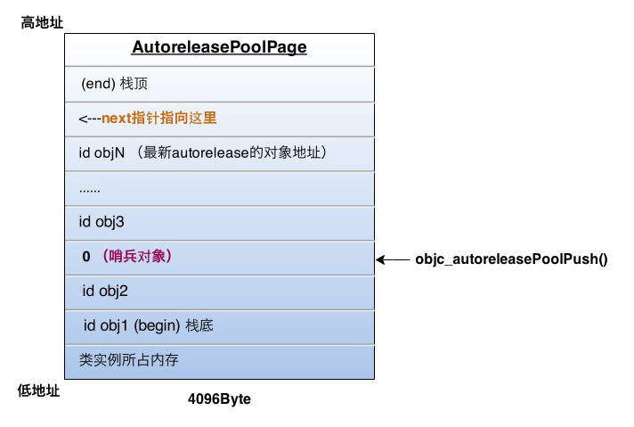

#iOS面试题总结
##1. Autorelease对象什么时候释放
###正确答案:
>在没有手加Autorelease Pool的情况下，Autorelease对象是在当前的runloop迭代结束时释放的，而它能够释放的原因是系统在每个runloop迭代中都加入了自动释放池Push和Pop

```
@autoreleasepool{
}
```
@atutoreleasepool{}会被自动转化为__AtAutoreleasePool的结构体

```
{
    __AtAutoreleasePool __autoreleasepool;
}
```
这个结构体会在初始化时调用 objc_autoreleasePoolPush() 方法，会在析构时调用 objc_autoreleasePoolPop 方法
```
void *context = objc_autoreleasePoolPush( ):
// {} 中的代码
objc_autoreleasePoolPoor(context);
```
这两个方法分别是对**AutoreleasePoolPage**静态方法的封装，每一个自动释放池都是由一系列的 AutoreleasePoolPage 组成的，并且每一个 AutoreleasePoolPage 的大小都是 4096 字节，以双向链表的形式连接起来。
**objc_autoreleasePoolPush**调用时，runtime向当前的**AutoreleasePoolPage**中加入一个哨兵对象，值为0


**objc_autoreleasePoolPush**的返回值是这个哨兵对象的地址，被**objc_autoreleasePoolPop**(哨兵对象地址)作为参数：
1. 根据传入哨兵对象地址找到哨兵对象所处的page
2. 在当前page中，将晚于哨兵对象插入的所有autorelease对象都发送一次 -release 消息，并向回移动next指针到正确的位置
3. 从最新加入的对象一直向前清理，可以向前跨越若干个page，直到哨兵所在的page
###参考资料:
[自动释放池的前世今生 ---- 深入解析 autoreleasepool](http://draveness.me/autoreleasepool/)

[黑幕背后的Autorelease](http://blog.sunnyxx.com/2014/10/15/behind-autorelease/)